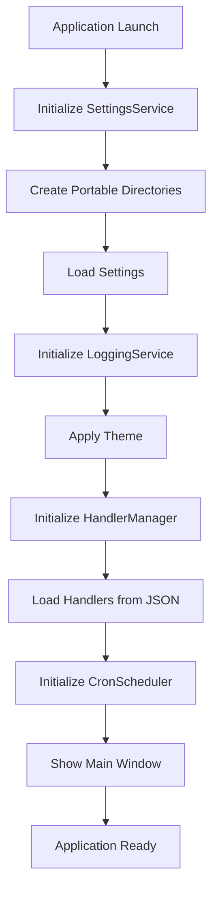
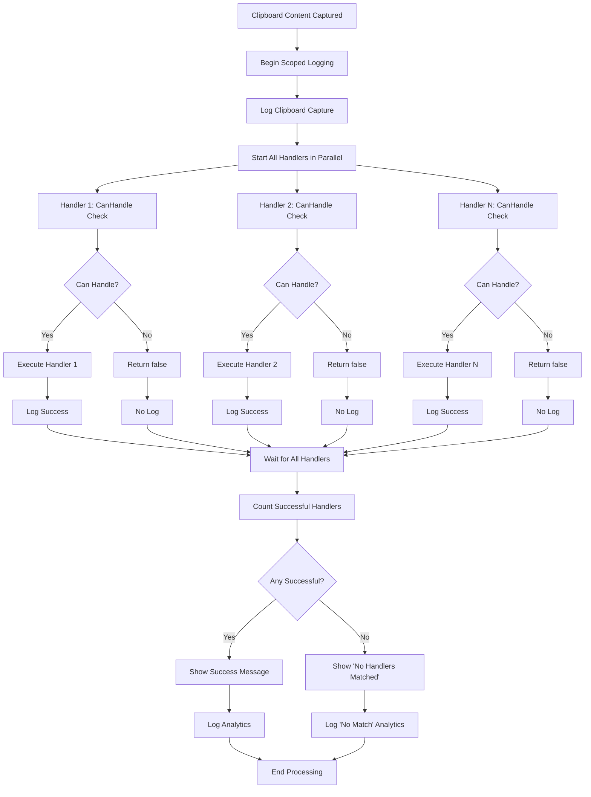
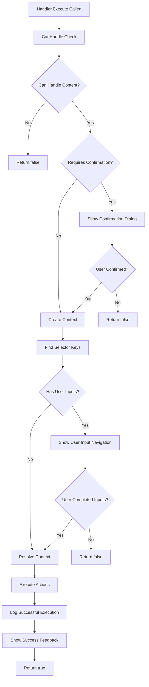
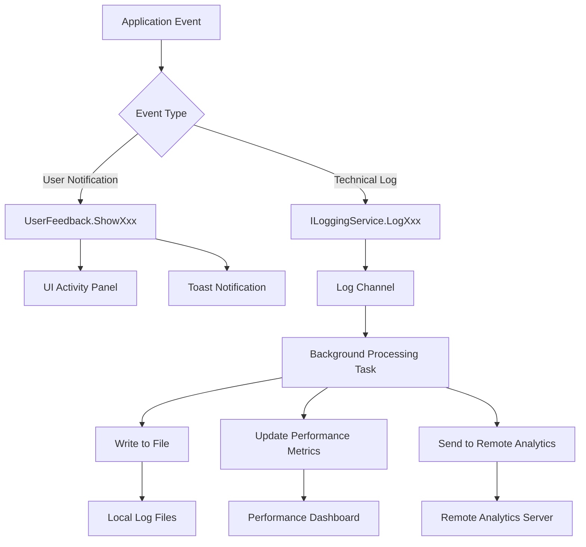
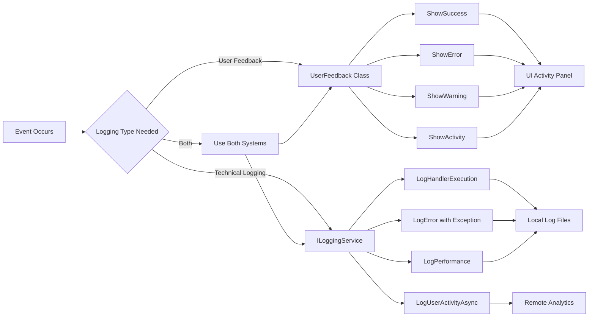

# 🔄 Contextualizer Complete System Flow

## 📋 **Table of Contents**
1. [Application Startup Flow](#application-startup-flow)
2. [Portable Directory Creation](#portable-directory-creation)
3. [Clipboard Processing Flow](#clipboard-processing-flow)
4. [Handler Execution Flow](#handler-execution-flow)
5. [Template System Flow](#template-system-flow)
6. [Logging & Analytics Flow](#logging--analytics-flow)
7. [Handler Marketplace Flow](#handler-marketplace-flow)
8. [Error Handling Flow](#error-handling-flow)
9. [Performance Optimization](#performance-optimization)
10. [Mermaid Diagrams](#mermaid-diagrams)

---

## 🚀 **Application Startup Flow**

### **1. Application Launch (`App.xaml.cs`)**
```csharp
protected override async void OnStartup(StartupEventArgs e)
{
    // 1. Initialize Settings Service
    _settingsService = new SettingsService();
    ServiceLocator.Register<SettingsService>(_settingsService);
    
    // 2. Initialize Logging Service
    _loggingService = new LoggingService();
    var loggingConfig = _settingsService.Settings.LoggingSettings.ToLoggingConfiguration();
    _loggingService.SetConfiguration(loggingConfig);
    ServiceLocator.Register<ILoggingService>(_loggingService);
    
    // 3. Log Application Startup
    using (_loggingService.BeginScope("ApplicationStartup", context))
    {
        _loggingService.LogInfo("Application startup initiated");
    }
    
    // 4. Apply Theme
    ThemeManager.Instance.ApplyTheme(_settingsService.Settings.UISettings.Theme);
    
    // 5. Initialize Handler Manager
    _handlerManager = new HandlerManager();
    await _handlerManager.StartAsync();
    
    // 6. Initialize Cron Scheduler
    _cronScheduler = new CronScheduler();
    await _cronScheduler.StartAsync();
    
    // 7. Show Main Window
    _mainWindow = new MainWindow();
    _mainWindow.Show();
}
```

### **2. Settings Service Initialization (`SettingsService.cs`)**
```csharp
public SettingsService()
{
    // 1. Set Portable Path
    _settingsPath = Path.Combine(@"C:\PortableApps\Contextualizer\Config", "appsettings.json");
    
    // 2. Create Portable Directory Structure
    CreatePortableDirectories();
    
    // 3. Load Settings
    LoadSettings();
}

private void CreatePortableDirectories()
{
    // Create Directory Structure:
    // C:\PortableApps\Contextualizer\
    // ├── Config\
    // ├── Data\Exchange\
    // ├── Data\Installed\
    // ├── Data\Logs\
    // ├── Plugins\
    // └── Temp\
    
    // Create Default handlers.json with Welcome Handler
    // Create Sample Exchange Handler (Email Extractor)
}
```

---

## 📁 **Portable Directory Creation**

### **Directory Structure Creation Flow:**
```
1. Application Starts
   ↓
2. SettingsService Constructor
   ↓
3. CreatePortableDirectories()
   ↓
4. Check if C:\PortableApps\Contextualizer\ exists
   ↓
5. Create All Required Directories:
   - Config\
   - Data\Exchange\
   - Data\Installed\
   - Data\Logs\
   - Plugins\
   - Temp\
   ↓
6. Create Default handlers.json if not exists
   ↓
7. Create Sample Exchange Handler if directory empty
   ↓
8. Continue with normal startup
```

### **Default Files Created:**

#### **handlers.json**
```json
{
  "handlers": [
    {
      "name": "Welcome Handler",
      "type": "manual",
      "screen_id": "welcome_screen",
      "title": "Welcome to Contextualizer!",
      "description": "Sample handler to get started",
      "actions": [
        {
          "name": "show_notification",
          "message": "Welcome to Contextualizer! 🎉\n\nPortable installation ready!",
          "title": "Welcome",
          "duration": 10
        }
      ]
    }
  ]
}
```

#### **sample-regex-handler.json** (Exchange)
```json
{
  "id": "sample-regex-handler",
  "name": "Sample Regex Handler",
  "version": "1.0.0",
  "author": "Contextualizer Team",
  "description": "Extracts email addresses from clipboard content",
  "tags": ["sample", "regex", "email"],
  "handlerJson": {
    "name": "Email Extractor",
    "type": "regex",
    "screen_id": "email_screen",
    "title": "Extract Email Addresses",
    "regex": "\\b[A-Za-z0-9._%+-]+@[A-Za-z0-9.-]+\\.[A-Z|a-z]{2,}\\b",
    "actions": [
      {
        "name": "simple_print_key",
        "key": "_self"
      }
    ],
    "output_format": "Found email: $(_match)"
  }
}
```

---

## 📋 **Clipboard Processing Flow**

### **1. Clipboard Capture (`HandlerManager.cs`)**
```csharp
private async void OnTextCaptured(object? sender, ClipboardCapturedEventArgs e)
{
    var logger = ServiceLocator.SafeGet<ILoggingService>();
    var contentLength = e.ClipboardContent?.IsText == true ? e.ClipboardContent.Text?.Length ?? 0 : 0;
    
    // 1. Begin Scoped Logging
    using (logger?.BeginScope("ClipboardProcessing", context))
    {
        // 2. Log Clipboard Capture
        UserFeedback.ShowActivity(LogType.Info, $"Processing clipboard content: {preview}...");
        logger?.LogDebug($"Clipboard content captured: {contentLength} characters");
        
        // 3. Log User Activity Analytics
        _ = logger?.LogUserActivityAsync("clipboard_capture", captureData);
        
        // 4. Process All Handlers in Parallel
        int totalHandlers = _handlers.Count;
        var handlerTasks = new List<Task<bool>>();
        
        foreach (var handler in _handlers)
        {
            var handlerTask = ExecuteHandlerAsync(handler, e.ClipboardContent, logger, contentLength);
            handlerTasks.Add(handlerTask);
        }
        
        // 5. Wait for All Handlers to Complete
        bool[] results = await Task.WhenAll(handlerTasks);
        int handlersProcessed = results.Count(r => r);
        
        // 6. Log Processing Summary
        logger?.LogInfo($"Clipboard processing completed: {handlersProcessed}/{totalHandlers} handlers processed content");
        
        // 7. User Feedback Based on Results
        if (handlersProcessed == 0)
        {
            UserFeedback.ShowActivity(LogType.Warning, $"No handlers could process the clipboard content ({contentLength} chars)");
            
            // Log "No Handlers Matched" Analytics
            _ = logger?.LogUserActivityAsync("clipboard_no_handlers_matched", noMatchData);
        }
        else if (handlersProcessed == 1)
        {
            UserFeedback.ShowActivity(LogType.Info, "1 handler processed the clipboard content");
        }
        else
        {
            UserFeedback.ShowSuccess($"{handlersProcessed} handlers processed the clipboard content");
        }
    }
}
```

### **2. Individual Handler Execution (`ExecuteHandlerAsync`)**
```csharp
private async Task<bool> ExecuteHandlerAsync(IHandler handler, ClipboardContent clipboardContent, ILoggingService? logger, int contentLength)
{
    using (logger?.BeginScope("HandlerExecution", handlerContext))
    {
        var stopwatch = Stopwatch.StartNew();
        try
        {
            // 1. Execute Handler (returns bool indicating if content was processed)
            bool wasProcessed = await handler.Execute(clipboardContent);
            stopwatch.Stop();
            
            // 2. Return Success Status
            return wasProcessed;
        }
        catch (Exception ex)
        {
            stopwatch.Stop();
            
            // 3. User Error Feedback
            UserFeedback.ShowError($"Handler {handler.GetType().Name} failed: {ex.Message}");
            
            // 4. Technical Error Logging
            logger?.LogHandlerError(handler.HandlerConfig.Name, handler.GetType().Name, ex, errorContext);
            
            return false;
        }
    }
}
```

---

## ⚙️ **Handler Execution Flow**

### **1. Handler Execute Method (`Dispatch.cs`)**
```csharp
public async Task<bool> Execute(ClipboardContent clipboardContent)
{
    var logger = ServiceLocator.SafeGet<ILoggingService>();
    var stopwatch = Stopwatch.StartNew();
    
    // 1. Check if Handler Can Process Content
    bool canHandle = await CanHandleAsync(clipboardContent);
    if (!canHandle)
    {
        return false;  // Cannot handle this content
    }
    
    // 2. Confirmation Check (if required)
    if (HandlerConfig.RequiresConfirmation)
    {
        bool confirmed = await ServiceLocator.Get<IUserInteractionService>()
            .ShowConfirmationAsync("Handler Confirmation", confirmationMessage);
        
        if (!confirmed)
        {
            UserFeedback.ShowWarning($"Handler {HandlerConfig.Name} cancelled");
            return false;
        }
    }
    
    // 3. Create Context
    var context = await CreateContextAsync(clipboardContent);
    ContextWrapper contextWrapper = new ContextWrapper(context.AsReadOnly(), HandlerConfig);
    
    // 4. Find Selector Keys
    FindSelectorKey(clipboardContent, contextWrapper);
    
    // 5. Process User Inputs (with Navigation)
    HandlerContextProcessor handlerContextProcessor = new HandlerContextProcessor();
    bool isUserCompleted = handlerContextProcessor.PromptUserInputsWithNavigation(HandlerConfig.UserInputs, contextWrapper);
    
    if (!isUserCompleted)
    {
        UserFeedback.ShowWarning($"Handler {HandlerConfig.Name} cancelled by user input");
        return false;
    }
    
    // 6. Resolve Context Variables
    handlerContextProcessor.ContextResolve(HandlerConfig.ConstantSeeder, HandlerConfig.Seeder, contextWrapper);
    ContextDefaultSeed(contextWrapper);
    
    // 7. Execute Actions
    DispatchAction(GetActions(), contextWrapper);
    
    // 8. Log Successful Execution
    stopwatch.Stop();
    logger?.LogHandlerExecution(
        HandlerConfig.Name,
        this.GetType().Name,
        stopwatch.Elapsed,
        true,
        executionContext
    );
    
    // 9. User Success Feedback
    UserFeedback.ShowActivity(LogType.Info, $"Handler '{HandlerConfig.Name}' processed content successfully");
    
    return true;  // Successfully processed
}
```

### **2. Handler Types and Their CanHandle Logic:**

#### **RegexHandler**
```csharp
protected override async Task<bool> CanHandleAsync(ClipboardContent clipboardContent)
{
    if (!clipboardContent.IsText || string.IsNullOrEmpty(clipboardContent.Text))
        return false;
        
    if (regex == null)
        return false;
        
    return regex.IsMatch(clipboardContent.Text);
}
```

#### **DatabaseHandler**
```csharp
protected override async Task<bool> CanHandleAsync(ClipboardContent clipboardContent)
{
    if (!clipboardContent.IsText || 
        string.IsNullOrEmpty(clipboardContent.Text) ||
        string.IsNullOrEmpty(HandlerConfig.Query) ||
        !IsSafeSqlQuery(HandlerConfig.Query) ||
        string.IsNullOrEmpty(HandlerConfig.ConnectionString))
    {
        return false;
    }
    
    // Regex check if specified
    if (regex != null && !regex.IsMatch(clipboardContent.Text))
        return false;
        
    return true;
}
```

#### **CustomHandler**
```csharp
protected override async Task<bool> CanHandleAsync(ClipboardContent clipboardContent)
{
    if (clipboardContent == null || !clipboardContent.Success)
    {
        UserFeedback.ShowError("Invalid clipboard content provided to CustomHandler");
        return false;
    }
    
    if (string.IsNullOrWhiteSpace(HandlerConfig.Validator))
    {
        UserFeedback.ShowError("No validator configured for CustomHandler");
        return false;
    }
    
    var validator = _actionService.GetContentValidator(HandlerConfig.Validator);
    if (validator == null)
    {
        UserFeedback.ShowError($"Validator {HandlerConfig.Validator} not found");
        return false;
    }
    
    return await validator.Validate(clipboardContent);
}
```

---

## 🎨 **Template System Flow**

### **1. Template Installation (`FileHandlerExchange.cs`)**
```csharp
public async Task<bool> InstallHandlerAsync(string handlerId)
{
    // 1. Get Handler Package
    var package = await GetHandlerDetailsAsync(handlerId);
    if (package == null) return false;
    
    // 2. Process Template User Inputs (if any)
    var processedHandlerJson = package.HandlerJson.GetRawText();
    if (package.TemplateUserInputs != null && package.TemplateUserInputs.Any())
    {
        // 3. Collect User Inputs with Navigation
        var templateValues = ProcessTemplateUserInputs(package.TemplateUserInputs);
        
        if (!templateValues.Any())
        {
            return false;  // User cancelled
        }
        
        // 4. Replace Placeholders in Handler JSON
        processedHandlerJson = ProcessTemplateJson(processedHandlerJson, templateValues);
    }
    
    // 5. Add to handlers.json
    var currentHandlers = await File.ReadAllTextAsync(_handlersFilePath);
    using var handlersDoc = JsonDocument.Parse(currentHandlers);
    var handlersElement = handlersDoc.RootElement.GetProperty("handlers");
    
    var handlersList = new List<object>();
    foreach (var handler in handlersElement.EnumerateArray())
    {
        handlersList.Add(JsonSerializer.Deserialize<object>(handler.GetRawText()));
    }
    
    // 6. Add Processed Handler
    var newHandlerObject = JsonSerializer.Deserialize<object>(processedHandlerJson);
    handlersList.Add(newHandlerObject);
    
    var updatedHandlers = new { handlers = handlersList };
    
    // 7. Save with UnsafeRelaxedJsonEscaping (preserves + characters in regex)
    var options = new JsonSerializerOptions
    {
        WriteIndented = true,
        PropertyNamingPolicy = JsonNamingPolicy.CamelCase,
        Encoder = System.Text.Encodings.Web.JavaScriptEncoder.UnsafeRelaxedJsonEscaping
    };
    
    await File.WriteAllTextAsync(_handlersFilePath, JsonSerializer.Serialize(updatedHandlers, options));
    
    // 8. Create Installation Record
    await File.WriteAllTextAsync(
        Path.Combine(_installedHandlersPath, $"{package.Id}.json"),
        JsonSerializer.Serialize(package, _jsonOptions)
    );
    
    return true;
}
```

### **2. Template User Input Processing**
```csharp
private Dictionary<string, string> ProcessTemplateUserInputs(List<UserInputRequest> templateUserInputs)
{
    var templateValues = new Dictionary<string, string>();
    var userInteraction = ServiceLocator.Get<IUserInteractionService>();
    
    // Use Navigation System for Step-by-Step Input
    foreach (var input in templateUserInputs)
    {
        // Show input dialog with back/next/cancel navigation
        var userValue = userInteraction.GetUserInput(input);
        
        if (string.IsNullOrEmpty(userValue) && input.IsRequired)
        {
            // User cancelled or provided invalid input
            return new Dictionary<string, string>();
        }
        
        templateValues[input.Key] = userValue ?? input.DefaultValue ?? "";
    }
    
    return templateValues;
}
```

### **3. Placeholder Replacement**
```csharp
private string ProcessTemplateJson(string handlerJsonString, Dictionary<string, string> templateValues)
{
    if (templateValues == null || !templateValues.Any())
        return handlerJsonString;
    
    // Use existing system format: $(key)
    return HandlerContextProcessor.ReplaceDynamicValues(handlerJsonString, templateValues);
}
```

### **4. Template Example Flow:**
```
1. User clicks "Install" on template
   ↓
2. System loads template JSON with TemplateUserInputs
   ↓
3. Navigation UI shows first input: "Database Server"
   ↓
4. User enters "localhost\SQLEXPRESS" → Next
   ↓
5. Navigation UI shows second input: "Database Name"
   ↓
6. User enters "MyDatabase" → Next
   ↓
7. System replaces placeholders:
   "Server=$(server_name);Database=$(database_name);"
   becomes:
   "Server=localhost\SQLEXPRESS;Database=MyDatabase;"
   ↓
8. Processed handler added to handlers.json
   ↓
9. Installation record saved to Data/Installed/
   ↓
10. Handler ready to use
```

---

## 📊 **Logging & Analytics Flow**

### **1. Dual Logging Architecture**

#### **User Activity Feedback (UI)**
```csharp
// For user-visible notifications
UserFeedback.ShowSuccess("Handler completed successfully");
UserFeedback.ShowWarning("No handlers could process the content");
UserFeedback.ShowError("Database connection failed");
UserFeedback.ShowActivity(LogType.Info, "Processing clipboard content...");
```

#### **System Logging (Technical)**
```csharp
// For technical monitoring and analytics
logger?.LogHandlerExecution(handlerName, handlerType, duration, success, context);
logger?.LogError("Database connection failed", exception, context);
logger?.LogPerformance("handler_execution", duration, context);
await logger?.LogUserActivityAsync("clipboard_capture", analyticsData);
```

### **2. Asynchronous Logging System**
```csharp
public class LoggingService : ILoggingService, IDisposable
{
    private readonly Channel<LogEntry> _logChannel;
    private readonly Task _backgroundLoggingTask;
    
    public LoggingService()
    {
        // 1. Create Bounded Channel for Log Entries
        var options = new BoundedChannelOptions(10000)
        {
            FullMode = BoundedChannelFullMode.Wait,
            SingleReader = true,
            SingleWriter = false
        };
        _logChannel = Channel.CreateBounded<LogEntry>(options);
        
        // 2. Start Background Processing Task
        _backgroundLoggingTask = Task.Run(ProcessLogEntriesAsync);
    }
    
    private async Task ProcessLogEntriesAsync()
    {
        // 3. Process Log Entries Asynchronously
        await foreach (var logEntry in _logReader.ReadAllAsync(_cancellationTokenSource.Token))
        {
            try
            {
                // 4. Write to File
                WriteToFile(GetLogFileName(logEntry.Level), logEntry);
                
                // 5. Update Performance Metrics
                UpdatePerformanceMetrics(logEntry.Component, stopwatch.Elapsed, false);
            }
            catch (Exception ex)
            {
                // 6. Fallback to Console
                Console.WriteLine($"Logging failed: {ex.Message}");
            }
        }
    }
}
```

### **3. Structured Logging with Scopes**
```csharp
// Create Scoped Context
using (logger?.BeginScope("ClipboardProcessing", new Dictionary<string, object>
{
    ["content_length"] = contentLength,
    ["content_type"] = contentType,
    ["handlers_count"] = handlersCount,
    ["correlation_id"] = Guid.NewGuid().ToString()
}))
{
    // All logs within this scope include the context
    logger?.LogInfo("Processing started");
    logger?.LogDebug("Handler validation completed");
    logger?.LogInfo("Processing completed");
}
```

### **4. Performance Monitoring**
```csharp
public void LogPerformance(string operation, TimeSpan duration, Dictionary<string, object>? context = null)
{
    // Track performance metrics per component
    _performanceMetrics.AddOrUpdate(component, 
        new PerformanceMetrics { TotalLogs = 1, TotalDuration = duration },
        (key, existing) => 
        {
            existing.TotalLogs++;
            existing.TotalDuration = existing.TotalDuration.Add(duration);
            existing.LastUpdate = DateTime.UtcNow;
            return existing;
        });
}
```

### **5. Analytics Data Examples**

#### **Successful Handler Execution**
```json
{
  "eventType": "handler_execution",
  "timestamp": "2025-09-18T21:54:10.3741914Z",
  "userId": "5C6D6FCA4BF82E5D",
  "version": "1.0.0.0",
  "sessionId": "d8eadad9-3dee-438a-bd4d-ccac2f3d429f",
  "data": {
    "handler_name": "Database Handler",
    "handler_type": "CustomHandler",
    "duration_ms": 2.47,
    "success": true,
    "content_length": 150,
    "can_handle": true,
    "executed_actions": 2,
    "correlation_id": "abc123-def456"
  }
}
```

#### **No Handlers Matched**
```json
{
  "eventType": "clipboard_no_handlers_matched",
  "timestamp": "2025-09-18T21:54:15.1234567Z",
  "userId": "5C6D6FCA4BF82E5D",
  "version": "1.0.0.0",
  "sessionId": "d8eadad9-3dee-438a-bd4d-ccac2f3d429f",
  "data": {
    "content_length": 45,
    "total_handlers_checked": 5,
    "content_type": "text",
    "content_preview": "Some text that no handler could process...",
    "correlation_id": "xyz789-uvw012"
  }
}
```

---

## 🏪 **Handler Marketplace Flow**

### **1. Marketplace Discovery**
```csharp
public async Task<IEnumerable<HandlerPackage>> ListAvailableHandlersAsync(string searchTerm = null, string[] tags = null)
{
    var handlers = new List<HandlerPackage>();
    var installedHandlers = await GetInstalledHandlersAsync();
    
    // 1. Scan Exchange Directory
    var files = Directory.GetFiles(_exchangePath, "*.json")
                         .Where(f => !f.Contains("installed"));
    
    foreach (var file in files)
    {
        try
        {
            // 2. Parse Handler Package
            var json = await File.ReadAllTextAsync(file);
            var handler = JsonSerializer.Deserialize<HandlerPackage>(json, _jsonOptions);
            
            if (handler != null)
            {
                // 3. Check Installation Status
                var installedHandler = installedHandlers.FirstOrDefault(h => h.Id == handler.Id);
                handler.IsInstalled = installedHandler != null;
                
                // 4. Check for Updates
                if (installedHandler != null && handler.Version != installedHandler.Version)
                {
                    handler.HasUpdate = true;
                }
                
                // 5. Apply Filters
                if (MatchesSearchCriteria(handler, searchTerm, tags))
                {
                    handlers.Add(handler);
                }
            }
        }
        catch (Exception ex)
        {
            // Log parsing error but continue
            Console.WriteLine($"Error parsing handler file {file}: {ex.Message}");
        }
    }
    
    return handlers.OrderBy(h => h.Name);
}
```

### **2. Handler Package Structure**
```csharp
public class HandlerPackage
{
    public string Id { get; set; }
    public string Name { get; set; }
    public string Version { get; set; }
    public string Author { get; set; }
    public string Description { get; set; }
    public string[] Tags { get; set; }
    public DateTime CreatedDate { get; set; }
    public DateTime UpdatedDate { get; set; }
    public JsonElement HandlerJson { get; set; }
    public List<UserInputRequest> TemplateUserInputs { get; set; }  // For templates
    public Dictionary<string, string> Metadata { get; set; }
    public bool IsInstalled { get; set; }
    public bool HasUpdate { get; set; }
}
```

### **3. Installation Process**
```
1. User browses marketplace
   ↓
2. User clicks "Install" on handler
   ↓
3. System checks if handler has TemplateUserInputs
   ↓
4. If template: Show navigation UI for user inputs
   ↓
5. Process placeholder replacement
   ↓
6. Add processed handler to handlers.json
   ↓
7. Create installation record in Data/Installed/
   ↓
8. Reload handler manager
   ↓
9. Handler ready for use
```

---

## 🚨 **Error Handling Flow**

### **1. Application Level Error Handling**
```csharp
// App.xaml.cs - Global Exception Handler
protected override async void OnStartup(StartupEventArgs e)
{
    try
    {
        // Application initialization
    }
    catch (Exception ex)
    {
        if (_loggingService != null)
        {
            _loggingService.LogError("Critical startup error", ex, new Dictionary<string, object>
            {
                ["startup_phase"] = "initialization",
                ["args"] = e.Args
            });
        }
        
        MessageBox.Show($"Application failed to start: {ex.Message}", "Critical Error", 
                       MessageBoxButton.OK, MessageBoxImage.Error);
        Shutdown(1);
    }
}
```

### **2. Handler Level Error Handling**
```csharp
// HandlerManager.cs - Individual Handler Errors
private async Task<bool> ExecuteHandlerAsync(IHandler handler, ClipboardContent clipboardContent, ILoggingService? logger, int contentLength)
{
    try
    {
        bool wasProcessed = await handler.Execute(clipboardContent);
        return wasProcessed;
    }
    catch (Exception ex)
    {
        // 1. User-Friendly Error Message
        UserFeedback.ShowError($"Handler {handler.GetType().Name} failed: {ex.Message}");
        
        // 2. Technical Error Logging
        logger?.LogHandlerError(
            handler.HandlerConfig.Name, 
            handler.GetType().Name, 
            ex,
            new Dictionary<string, object>
            {
                ["content_length"] = contentLength,
                ["execution_time_ms"] = stopwatch.ElapsedMilliseconds,
                ["stack_trace"] = ex.StackTrace,
                ["inner_exception"] = ex.InnerException?.Message
            });
        
        return false;
    }
}
```

### **3. Logging Service Error Handling**
```csharp
// LoggingService.cs - Fallback Mechanisms
private void WriteToFile(string logType, LogEntry logEntry)
{
    try
    {
        // Primary: Write to configured log file
        var filePath = Path.Combine(_config.LocalLogPath, fileName);
        File.AppendAllText(filePath, json + Environment.NewLine);
    }
    catch (Exception ex)
    {
        try
        {
            // Fallback 1: Write to current directory
            var fallbackPath = Path.Combine(Environment.CurrentDirectory, "logs", fileName);
            Directory.CreateDirectory(Path.GetDirectoryName(fallbackPath));
            File.AppendAllText(fallbackPath, json + Environment.NewLine);
        }
        catch
        {
            // Fallback 2: Console output
            Console.WriteLine($"Logging failed: {ex.Message}");
            Console.WriteLine($"Original log: {logEntry.Level} - {logEntry.Message}");
        }
    }
}
```

### **4. Directory Creation Error Handling**
```csharp
// SettingsService.cs - Graceful Degradation
private void CreatePortableDirectories()
{
    try
    {
        // Create directory structure
    }
    catch (Exception ex)
    {
        // Log error but don't crash application
        System.Diagnostics.Debug.WriteLine($"Failed to create portable directory structure: {ex.Message}");
        
        // Application continues with default behavior
        // User can manually create directories if needed
    }
}
```

---

## ⚡ **Performance Optimization**

### **1. Parallel Handler Execution**
```csharp
// Before: Sequential execution (slow)
foreach (var handler in _handlers)
{
    await handler.Execute(clipboardContent);  // Waits for each handler
}
// Total time: Sum of all handler times

// After: Parallel execution (fast)
var handlerTasks = new List<Task<bool>>();
foreach (var handler in _handlers)
{
    var handlerTask = ExecuteHandlerAsync(handler, clipboardContent, logger, contentLength);
    handlerTasks.Add(handlerTask);  // Starts immediately, doesn't wait
}
bool[] results = await Task.WhenAll(handlerTasks);  // Wait for all to complete
// Total time: Time of slowest handler
```

### **2. Asynchronous Logging**
```csharp
// Non-blocking log writes using channels
public void LogInfo(string message, Dictionary<string, object>? context = null)
{
    var logEntry = CreateLogEntry(LogLevel.Info, message, null, context);
    
    // Add to channel (non-blocking)
    if (!_logWriter.TryWrite(logEntry))
    {
        // Channel full - handle gracefully
        Console.WriteLine("Log channel full, dropping log entry");
    }
}

// Background task processes logs asynchronously
private async Task ProcessLogEntriesAsync()
{
    await foreach (var logEntry in _logReader.ReadAllAsync(_cancellationTokenSource.Token))
    {
        WriteToFile(GetLogFileName(logEntry.Level), logEntry);
    }
}
```

### **3. Smart Handler Filtering**
```csharp
// Only execute handlers that can actually process the content
public async Task<bool> Execute(ClipboardContent clipboardContent)
{
    // Quick check first
    bool canHandle = await CanHandleAsync(clipboardContent);
    if (!canHandle)
    {
        return false;  // Skip expensive processing
    }
    
    // Only do expensive work if handler can process content
    // ...
}
```

### **4. Efficient JSON Serialization**
```csharp
// Reuse JsonSerializerOptions to avoid recreation overhead
private static readonly JsonSerializerOptions _jsonOptions = new JsonSerializerOptions
{
    WriteIndented = true,
    PropertyNamingPolicy = JsonNamingPolicy.CamelCase,
    Encoder = System.Text.Encodings.Web.JavaScriptEncoder.UnsafeRelaxedJsonEscaping
};
```

---

## 📈 **Mermaid Diagrams**

### **1. Application Startup Flow**


### **2. Clipboard Processing Flow**


### **3. Handler Execution Flow**


### **4. Template Installation Flow**
```mermaid
graph TD
    A[User Clicks Install Template] --> B[Load Template Package]
    B --> C{Has Template Inputs?}
    C -->|No| D[Use Handler JSON As-Is]
    C -->|Yes| E[Show First Input Dialog]
    E --> F[User Enters Value]
    F --> G{More Inputs?}
    G -->|Yes| H[Show Next Input Dialog]
    G -->|No| I[Collect All Values]
    H --> F
    I --> J[Replace Placeholders in JSON]
    J --> K[$(key) → user_value]
    K --> D
    D --> L[Parse Handler JSON]
    L --> M[Add to handlers.json]
    M --> N[Save Installation Record]
    N --> O[Reload Handler Manager]
    O --> P[Template Installed Successfully]
```

### **5. Logging Architecture**


### **6. Dual Logging System**


---

## 🎯 **Complete System Summary**

### **Key Innovations:**
1. **Portable Zero-Config**: Automatic directory structure creation
2. **Parallel Processing**: All handlers execute simultaneously
3. **Smart Logging**: Only successful handlers logged, with "no match" tracking
4. **Template System**: Dynamic handler customization during installation
5. **Dual Logging**: Separate UI feedback and technical analytics
6. **Asynchronous Architecture**: Non-blocking logging and processing
7. **Graceful Error Handling**: Multiple fallback mechanisms
8. **Performance Monitoring**: Built-in metrics and correlation tracking

### **Data Flow:**
```
Clipboard → Parallel Handlers → Smart Logging → Analytics
    ↓              ↓                ↓           ↓
User Sees:    Processing      Success/Error   Usage Stats
              Feedback       Messages        & Insights
```

### **File Structure:**
```
C:\PortableApps\Contextualizer\
├── Config\
│   ├── appsettings.json     # App configuration
│   └── handlers.json        # Handler definitions
├── Data\
│   ├── Exchange\           # Marketplace templates
│   ├── Installed\          # Installation records
│   └── Logs\              # Technical logs
├── Plugins\               # Custom plugins
└── Temp\                  # Temporary files
```

Bu sistem gerçekten comprehensive bir clipboard automation ve handler management platformu oldu! 🚀
