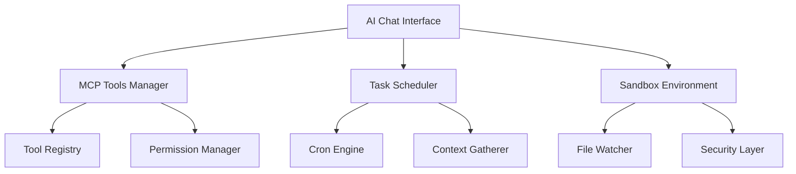

# 🤖 Contextualizer AI Agent Integration Kılavuzu

## 📖 İçindekiler
1. [AI Agent Genel Bakış](#ai-agent-genel-bakış)
2. [MCP Tools Entegrasyonu](#mcp-tools-entegrasyonu)
3. [Güvenli Sandbox Ortamı](#güvenli-sandbox-ortamı)
4. [Task Scheduling Sistemi](#task-scheduling-sistemi)
5. [UI/UX Tasarım](#uiux-tasarım)
6. [Otomasyon Olanakları](#otomasyon-olanakları)
7. [Genişletme Noktaları](#genişletme-noktaları)
8. [Güvenlik Modeli](#güvenlik-modeli)
9. [Gerçek Dünya Senaryoları](#gerçek-dünya-senaryoları)
10. [Implementation Roadmap](#implementation-roadmap)

## 🎯 AI Agent Genel Bakış

### 🚀 **Vizyon**
Contextualizer AI Agent, sadece chat değil, proaktif ve akıllı bir dijital asistan olacak. Günlük developer workflow'unu otomatikleştiren, öngörülü öneriler sunan ve ekip produktivitesini artıran bir sistem.

### 🎨 **Temel Prensipler**
- **🔒 Güvenlik Öncelikli**: Sandbox ortamı ile güvenli file operations
- **🤝 Context-Aware**: Mevcut çalışma ortamından bilinçli
- **⚡ Proaktif**: Scheduled tasks ile önceden harekete geçen
- **🔧 Genişletilebilir**: MCP tools ve plugin sistemi
- **🎭 Kullanıcı Dostu**: İntuitive UI/UX design

### 🏗️ **Mimari Bileşenler**



## 🛠️ MCP Tools Entegrasyonu

### 🔧 **Tool Management System**

#### **Tool Registry Architecture**
```csharp
public interface IMCPToolManager
{
    Task<List<MCPTool>> DiscoverToolsAsync();
    Task<MCPToolResult> ExecuteToolAsync(string toolName, object parameters);
    void RegisterTool(MCPTool tool);
    void EnableTool(string toolName, MCPToolConfig config);
    void DisableTool(string toolName);
    string GenerateSystemPrompt();
}

public class MCPTool
{
    public string Name { get; set; }
    public string Description { get; set; }
    public bool IsActive { get; set; }
    public ToolSafetyLevel SafetyLevel { get; set; }
    public List<ToolParameter> Parameters { get; set; }
    public ToolPermissions RequiredPermissions { get; set; }
    public ToolUsageStats Usage { get; set; }
}

public enum ToolSafetyLevel
{
    Safe,           // Read-only operations
    Moderate,       // Limited write operations
    Dangerous,      // Unrestricted access
    Sandboxed       // Sandbox içinde çalışır
}
```

### 🎛️ **Tool Configuration UI**

```
┌─────────────────── MCP Tools Manager ──────────────────┐
│                                          [Discover New] │
│ ┌─ Available Tools ────────────────────────────────────┐ │
│ │                                                      │ │
│ │ 🔍 codebase_search          [●] Enabled   [Config] │ │
│ │    │ Safe | 247 uses | Last: 2 min ago             │ │
│ │    └─ Search through project codebase               │ │
│ │                                                      │ │
│ │ 🌐 web_search               [●] Enabled   [Config] │ │
│ │    │ Safe | 89 uses | Last: 1 hour ago             │ │
│ │    └─ Search web for real-time information          │ │
│ │                                                      │ │
│ │ 💾 read_file                [●] Enabled   [Config] │ │
│ │    │ Moderate | 156 uses | Last: 5 min ago         │ │
│ │    └─ Read files from filesystem                    │ │
│ │                                                      │ │
│ │ ✏️ search_replace           [○] Disabled  [Config] │ │
│ │    │ Dangerous | Requires sandbox                   │ │
│ │    └─ Edit files with search and replace            │ │
│ │                                                      │ │
│ │ 🏃 run_terminal_cmd         [○] Disabled  [Config] │ │
│ │    │ Dangerous | Admin approval required            │ │
│ │    └─ Execute terminal commands                     │ │
│ │                                                      │ │
│ └──────────────────────────────────────────────────────┘ │
│                                                          │
│ ┌─ Tool Permissions Matrix ───────────────────────────┐  │
│ │           Read  Write  Network  Terminal  Sandbox   │  │
│ │ codebase   ✓     ✗       ✗        ✗        ✗      │  │
│ │ web_search ✗     ✗       ✓        ✗        ✗      │  │
│ │ read_file  ✓     ✗       ✗        ✗        ✗      │  │
│ │ search_rep ✓     ✓       ✗        ✗        ✓      │  │
│ │ terminal   ✓     ✓       ✓        ✓        ✓      │  │
│ └──────────────────────────────────────────────────────┘  │
└──────────────────────────────────────────────────────────┘
```

### ⚙️ **Tool Configuration Examples**

#### **Codebase Search Configuration**
```json
{
  "tool_name": "codebase_search",
  "enabled": true,
  "config": {
    "max_results": 15,
    "include_content": true,
    "search_directories": [
      "src/",
      "lib/", 
      "docs/"
    ],
    "exclude_patterns": [
      "*.log",
      "node_modules/",
      ".git/"
    ],
    "content_limit": 1000
  },
  "usage_limits": {
    "daily_limit": 1000,
    "rate_limit": "10/minute"
  }
}
```

#### **File Operations Configuration**
```json
{
  "tool_name": "search_replace",
  "enabled": true,
  "config": {
    "sandbox_mode": true,
    "allowed_extensions": [".cs", ".js", ".ts", ".json", ".md"],
    "backup_before_edit": true,
    "max_file_size": "10MB",
    "require_confirmation": true
  },
  "sandbox_config": {
    "base_directory": "C:\\Projects\\Contextualizer\\Sandbox",
    "auto_cleanup": true,
    "retention_days": 7
  }
}
```

## 🔒 Güvenli Sandbox Ortamı

### 🛡️ **Sandbox Architecture**

```csharp
public class SandboxEnvironment
{
    private readonly string _sandboxPath;
    private readonly FileSystemWatcher _watcher;
    private readonly SandboxConfig _config;
    
    public class SandboxConfig
    {
        public string BasePath { get; set; }
        public List<string> AllowedExtensions { get; set; }
        public long MaxFileSize { get; set; }
        public bool RequireUserConsent { get; set; }
        public bool AutoBackup { get; set; }
        public int RetentionDays { get; set; }
        public List<string> RestrictedPaths { get; set; }
    }
    
    public async Task<SandboxResult> ExecuteInSandboxAsync(SandboxOperation operation)
    {
        // 1. Validate operation
        if (!ValidateOperation(operation))
            return SandboxResult.Denied("Operation not allowed");
            
        // 2. Create backup if needed
        if (_config.AutoBackup)
            await CreateBackupAsync(operation.TargetFiles);
            
        // 3. Execute with monitoring
        var result = await ExecuteWithMonitoringAsync(operation);
        
        // 4. Log operation
        await LogOperationAsync(operation, result);
        
        return result;
    }
}
```

### 📁 **Sandbox UI Design**

```
┌─────────────────── Sandbox Environment ────────────────┐
│                                                         │
│ ┌─ Sandbox Status ───────────────────────────────────┐  │
│ │ 📁 Active Path: C:\Projects\Contextualizer\Sandbox │  │
│ │ 📊 Usage: 127MB / 1GB                              │  │
│ │ 🕒 Last Cleanup: 2 hours ago                       │  │
│ │ ⚠️  Pending Operations: 2                          │  │
│ └─────────────────────────────────────────────────────┘  │
│                                                         │
│ ┌─ Pending Operations ───────────────────────────────┐  │
│ │ ✏️  search_replace on DatabaseHandler.cs           │  │
│ │     │ Changes: 3 lines modified                     │  │
│ │     └─ [Review] [Approve] [Deny]                   │  │
│ │                                                     │  │
│ │ 📝 write_file: new_feature_spec.md                │  │
│ │     │ Size: 2.3KB | Type: Documentation            │  │
│ │     └─ [Review] [Approve] [Deny]                   │  │
│ └─────────────────────────────────────────────────────┘  │
│                                                         │
│ ┌─ Recent Activity ──────────────────────────────────┐  │
│ │ 16:23 ✅ Approved: Updated README.md               │  │
│ │ 16:15 ❌ Denied: Attempted to modify system file   │  │
│ │ 16:10 ✅ Approved: Created test_cases.json         │  │
│ │ 15:45 ⚠️  Backup created: 5 files (230KB)         │  │
│ └─────────────────────────────────────────────────────┘  │
│                                                         │
│ [Configure Sandbox] [View Backups] [Clean Up]          │
└─────────────────────────────────────────────────────────┘
```

### 🔐 **Security Layers**

#### **1. File Access Control**
```csharp
public class FileAccessController
{
    public bool CanAccess(string filePath, FileOperation operation)
    {
        // Path validation
        if (IsRestrictedPath(filePath))
            return false;
            
        // Extension check
        if (!IsAllowedExtension(filePath))
            return false;
            
        // Size limits
        if (operation == FileOperation.Write && ExceedsMaxSize(filePath))
            return false;
            
        // User consent for critical files
        if (IsCriticalFile(filePath))
            return RequestUserConsent(filePath, operation);
            
        return true;
    }
}
```

#### **2. Operation Monitoring**
```csharp
public class SandboxMonitor
{
    public event EventHandler<SuspiciousActivityEventArgs> SuspiciousActivity;
    
    public void MonitorOperation(SandboxOperation operation)
    {
        // Rate limiting
        if (ExceedsRateLimit(operation))
            RaiseAlert("Rate limit exceeded");
            
        // Pattern analysis
        if (DetectSuspiciousPattern(operation))
            RaiseAlert("Suspicious file access pattern");
            
        // Resource usage
        if (ExceedsResourceLimits())
            RaiseAlert("Resource limits exceeded");
    }
}
```

## ⏰ Task Scheduling Sistemi

### 📅 **Cron-Based Scheduling**

#### **Task Types**
```csharp
public abstract class AIScheduledTask
{
    public string Name { get; set; }
    public string CronExpression { get; set; }
    public bool IsEnabled { get; set; }
    public TaskType Type { get; set; }
    public Dictionary<string, object> Config { get; set; }
    
    public abstract Task ExecuteAsync(AITaskContext context);
}

public enum TaskType
{
    InteractiveConversation,  // User ile chat başlatır
    SilentAnalysis,          // Background'da analiz yapar
    NotificationOnly,        // Sadece bildirim gönderir
    WorkflowTrigger         // Başka işlemleri tetikler
}
```

### 🎯 **Predefined Task Templates**

#### **1. Daily Timesheet Assistant**
```csharp
public class TimesheetAssistantTask : AIScheduledTask
{
    public override async Task ExecuteAsync(AITaskContext context)
    {
        // Context gathering
        var workContext = await GatherWorkContextAsync();
        var conversation = await StartConversationAsync($@"
🕐 Daily Timesheet Assistant

Today's Summary:
• Git Commits: {workContext.CommitCount} commits
• Meetings: {workContext.MeetingCount} meetings  
• Active Tasks: {workContext.TaskCount} items
• Working Hours: {workContext.WorkingHours}

Let me help you complete your timesheet with some questions:

1. What were your main accomplishments today?
2. How much time did you spend on each project?
3. Any blockers or challenges you faced?
4. What are your priorities for tomorrow?

Please tell me about your day, and I'll help format it for your timesheet system.");

        await ProcessTimesheetResponsesAsync(conversation);
    }
}
```

#### **2. Code Review Automation**
```csharp
public class CodeReviewTask : AIScheduledTask
{
    public override async Task ExecuteAsync(AITaskContext context)
    {
        var pullRequests = await GetPendingPullRequestsAsync();
        
        foreach (var pr in pullRequests)
        {
            var analysis = await AnalyzePullRequestAsync(pr);
            
            if (analysis.RequiresAttention)
            {
                await NotifyReviewerAsync(pr, analysis);
            }
            
            if (analysis.CanAutoApprove)
            {
                await CreateAutoApprovalSuggestionAsync(pr, analysis);
            }
        }
    }
}
```

#### **3. Project Health Monitor**
```csharp
public class ProjectHealthTask : AIScheduledTask
{
    public override async Task ExecuteAsync(AITaskContext context)
    {
        var metrics = await GatherProjectMetricsAsync();
        
        var report = await GenerateHealthReportAsync(metrics);
        
        if (report.HasIssues)
        {
            await CreateIssueTicketsAsync(report.Issues);
            await NotifyTeamLeadAsync(report);
        }
        
        await UpdateDashboardAsync(report);
    }
}
```

### 📋 **Task Configuration UI**

```
┌─────────────────── AI Task Scheduler ──────────────────┐
│ [Add Task] [Import Template] [Export Config]           │
│                                                         │
│ ┌─ Active Tasks ─────────────────────────────────────┐  │
│ │                                                     │  │
│ │ ⏰ Daily Timesheet        [●] 16:00 Mon-Fri        │  │
│ │    │ Last: ✅ Today 16:00 (Success)                │  │
│ │    │ Next: Tomorrow 16:00                           │  │
│ │    └─ [Edit] [Test Now] [View History] [Disable]   │  │
│ │                                                     │  │
│ │ 🔍 Code Review Monitor    [●] 09:00,17:00 Mon-Fri  │  │
│ │    │ Last: ✅ Today 17:00 (2 PRs analyzed)         │  │
│ │    │ Next: Tomorrow 09:00                           │  │
│ │    └─ [Edit] [Test Now] [View History] [Disable]   │  │
│ │                                                     │  │
│ │ 📊 Weekly Team Report     [●] 17:00 Friday         │  │
│ │    │ Last: ✅ Friday 17:00 (Report sent)           │  │
│ │    │ Next: Next Friday 17:00                       │  │
│ │    └─ [Edit] [Test Now] [View History] [Disable]   │  │
│ │                                                     │  │
│ │ 🚨 Emergency Monitor      [○] Disabled              │  │
│ │    │ Monitors: Build failures, security alerts      │  │
│ │    └─ [Edit] [Enable] [Delete]                     │  │
│ │                                                     │  │
│ └─────────────────────────────────────────────────────┘  │
│                                                         │
│ ┌─ Task Templates ───────────────────────────────────┐  │
│ │ 📋 Timesheet Assistant                             │  │
│ │ 🔍 Code Review Automation                          │  │
│ │ 📊 Project Health Monitor                          │  │
│ │ 🎯 Sprint Planning Helper                          │  │
│ │ 📝 Documentation Updater                           │  │
│ │ 🔔 Deadline Reminder                               │  │
│ └─────────────────────────────────────────────────────┘  │
└─────────────────────────────────────────────────────────┘
```

## 🎨 UI/UX Tasarım

### 🖥️ **Ana Dashboard Design**

```
┌────────────────── Contextualizer AI Hub ───────────────┐
│ 🏠 Home │ 🤖 AI Chat │ 🛠️ Tools │ ⏰ Tasks │ ⚙️ Settings │
├─────────────────────────────────────────────────────────┤
│                                                         │
│ ┌─ AI Agent Status ──────┐ ┌─ Quick Actions ───────────┐ │
│ │ 🟢 Online & Ready      │ │ 💬 Start Conversation    │ │
│ │ 🧠 Model: GPT-4 Turbo  │ │ 📋 Analyze Clipboard     │ │
│ │ 🔧 Tools: 8 active     │ │ 🔍 Search Codebase       │ │
│ │ ⏰ Tasks: 3 scheduled  │ │ 📝 Create Task           │ │
│ └────────────────────────┘ └───────────────────────────┘ │
│                                                         │
│ ┌─ Recent Conversations ─────────────────────────────┐  │
│ │ 🕐 16:35 │ Timesheet assistance completed         │  │
│ │ 🕐 14:22 │ Code review for PR #145                │  │
│ │ 🕐 11:15 │ Bug investigation in AuthService      │  │
│ │ 🕐 09:30 │ Sprint planning discussion             │  │
│ └─────────────────────────────────────────────────────┘  │
│                                                         │
│ ┌─ Automation Insights ──────────────────────────────┐  │
│ │ 📊 This Week:                                      │  │
│ │    • 23 hours saved through automation            │  │
│ │    • 45 tasks completed automatically             │  │
│ │    • 12 code reviews assisted                     │  │
│ │    • 89% user satisfaction score                  │  │
│ └─────────────────────────────────────────────────────┘  │
└─────────────────────────────────────────────────────────┘
```

### 💬 **Enhanced Chat Interface**

```
┌─────────────────── AI Assistant Chat ──────────────────┐
│ 🤖 GPT-4 Turbo │ [Tools: 8] │ [⚙️] │ [📋] │ [🔍] │ [❌] │
├─────────────────────────────────────────────────────────┤
│                                                         │
│ ┌─ Context Panel ────────────────────────────────────┐  │
│ │ 📁 Current: Contextualizer.Core/HandlerManager.cs │  │
│ │ 📋 Clipboard: "async Task ExecuteHandler..."      │  │
│ │ 🔧 Active Tools: codebase_search, read_file       │  │
│ │ 📊 Context: 3,247 tokens                          │  │
│ └─────────────────────────────────────────────────────┘  │
│                                                         │
│ ┌─ Conversation ─────────────────────────────────────┐  │
│ │                                                     │  │
│ │ User: Can you help me optimize this handler code?  │  │
│ │                                                [💬] │  │
│ │                                                     │  │
│ │ 🤖 I'll analyze the handler code for optimization  │  │
│ │    opportunities. Let me examine the current       │  │
│ │    implementation:                                  │  │
│ │                                                     │  │
│ │    🔧 Using tool: read_file                        │  │
│ │    📄 Reading HandlerManager.cs...                 │  │
│ │                                                     │  │
│ │    ✅ Analysis complete! I found several areas     │  │
│ │    for improvement:                                 │  │
│ │                                                     │  │
│ │    1. **Async Performance**: The Execute method    │  │
│ │       can be optimized by...                       │  │
│ │                                          [📋] [🔄] │  │
│ │                                                     │  │
│ │ ┌─ Suggested Actions ─────────────────────────────┐ │  │
│ │ │ 🚀 Apply Optimizations    🔍 Show Diff        │ │  │
│ │ │ 📝 Create Task           📊 Run Benchmarks    │ │  │
│ │ └─────────────────────────────────────────────────┘ │  │
│ └─────────────────────────────────────────────────────┘  │
│                                                         │
│ ┌─ Smart Input ──────────────────────────────────────┐  │
│ │ [📎] [📋] Type your message...          [🎤] [📤] │  │
│ │                                                     │  │
│ │ 💡 Suggestions:                                    │  │
│ │ • "Explain this error message"                     │  │
│ │ • "Create unit tests for this method"              │  │
│ │ • "Generate documentation"                         │  │
│ └─────────────────────────────────────────────────────┘  │
└─────────────────────────────────────────────────────────┘
```

### 🔧 **Tool Configuration Modal**

```
┌─────────────── Configure: codebase_search ─────────────┐
│                                                  [❌]   │
│ ┌─ Basic Settings ───────────────────────────────────┐  │
│ │ Enabled: [✓] Allow AI to search through codebase  │  │
│ │ Max Results: [15        ] ▼                        │  │
│ │ Include Content: [✓] Show file content in results │  │
│ │ Content Limit: [1000    ] characters per file     │  │
│ └─────────────────────────────────────────────────────┘  │
│                                                         │
│ ┌─ Search Scope ─────────────────────────────────────┐  │
│ │ Included Directories:                               │  │
│ │ ┌─────────────────────────────────────────────────┐ │  │
│ │ │ ✓ src/                                          │ │  │
│ │ │ ✓ lib/                                          │ │  │
│ │ │ ✓ docs/                                         │ │  │
│ │ │ ❌ tests/                                        │ │  │
│ │ │ ❌ node_modules/                                 │ │  │
│ │ └─────────────────────────────────────────────────┘ │  │
│ │                                        [Add Path]   │  │
│ │                                                     │  │
│ │ File Type Filters:                                  │  │
│ │ ┌─────────────────────────────────────────────────┐ │  │
│ │ │ [*.cs] [*.js] [*.ts] [*.json] [*.md] [*.xml]   │ │  │
│ │ └─────────────────────────────────────────────────┘ │  │
│ └─────────────────────────────────────────────────────┘  │
│                                                         │
│ ┌─ Usage Limits ─────────────────────────────────────┐  │
│ │ Daily Limit: [1000   ] searches per day            │  │
│ │ Rate Limit: [10      ] searches per minute         │  │
│ │ Cost Alert: [✓] Notify when usage exceeds $5/day  │  │
│ └─────────────────────────────────────────────────────┘  │
│                                                         │
│ ┌─ Security ─────────────────────────────────────────┐  │
│ │ Log Searches: [✓] Keep audit log                   │  │
│ │ Content Filter: [✓] Exclude sensitive patterns     │  │
│ │ User Approval: [❌] Require approval for each use   │  │
│ └─────────────────────────────────────────────────────┘  │
│                                                         │
│                     [Cancel] [Test] [Save]              │
└─────────────────────────────────────────────────────────┘
```

## 🚀 Otomasyon Olanakları

### 💻 **Development Workflow Automation**

#### **1. Intelligent Code Review**
```csharp
public class IntelligentCodeReviewAutomation
{
    public async Task<CodeReviewReport> AnalyzePullRequestAsync(PullRequest pr)
    {
        var analysis = new CodeReviewReport();
        
        // Otomatik kod analizi
        analysis.CodeQuality = await AnalyzeCodeQualityAsync(pr.Changes);
        analysis.SecurityIssues = await ScanSecurityVulnerabilitiesAsync(pr.Changes);
        analysis.PerformanceImpact = await AnalyzePerformanceImpactAsync(pr.Changes);
        analysis.TestCoverage = await CalculateTestCoverageAsync(pr.Changes);
        
        // AI destekli review
        analysis.AIRecommendations = await GetAIRecommendationsAsync(pr);
        analysis.SuggestedImprovements = await GenerateImprovementSuggestionsAsync(pr);
        
        // Otomatik approval logic
        if (analysis.CanAutoApprove())
        {
            await CreateAutoApprovalSuggestionAsync(pr, analysis);
        }
        
        return analysis;
    }
}
```

#### **2. Smart Documentation Updates**
```csharp
public class DocumentationAutomation
{
    public async Task UpdateDocumentationAsync(CodeChange change)
    {
        // API değişikliklerini detect et
        var apiChanges = await DetectApiChangesAsync(change);
        
        if (apiChanges.Any())
        {
            // README.md'yi güncelle
            await UpdateReadmeAsync(apiChanges);
            
            // API documentation oluştur
            await GenerateApiDocsAsync(apiChanges);
            
            // CHANGELOG.md güncelle
            await UpdateChangelogAsync(apiChanges);
            
            // Migration guide oluştur if breaking changes
            if (apiChanges.HasBreakingChanges())
            {
                await CreateMigrationGuideAsync(apiChanges);
            }
        }
    }
}
```

#### **3. Automated Testing Strategy**
```csharp
public class TestAutomation
{
    public async Task GenerateTestsAsync(CodeChange change)
    {
        // Unit test generation
        var unitTests = await GenerateUnitTestsAsync(change.NewMethods);
        
        // Integration test suggestions
        var integrationTests = await SuggestIntegrationTestsAsync(change);
        
        // Test data generation
        var testData = await GenerateTestDataAsync(change.DataModels);
        
        // Performance test scenarios
        if (change.AffectsPerformance())
        {
            var perfTests = await GeneratePerformanceTestsAsync(change);
        }
        
        // Create test files
        await CreateTestFilesAsync(unitTests, integrationTests);
    }
}
```

### 📊 **Project Management Automation**

#### **1. Sprint Planning Assistant**
```csharp
public class SprintPlanningAutomation
{
    public async Task<SprintPlan> GenerateSprintPlanAsync(SprintContext context)
    {
        var plan = new SprintPlan();
        
        // Velocity analysis
        var velocity = await CalculateTeamVelocityAsync(context.TeamHistory);
        
        // Capacity planning
        var capacity = await CalculateSprintCapacityAsync(context.TeamMembers);
        
        // Task prioritization
        var prioritizedBacklog = await PrioritizeBacklogAsync(context.ProductBacklog);
        
        // Sprint goal suggestion
        plan.SprintGoal = await GenerateSprintGoalAsync(prioritizedBacklog);
        
        // Task assignment recommendations
        plan.TaskAssignments = await RecommendTaskAssignmentsAsync(
            prioritizedBacklog, 
            context.TeamMembers,
            velocity,
            capacity
        );
        
        return plan;
    }
}
```

#### **2. Risk Detection & Mitigation**
```csharp
public class RiskDetectionAutomation
{
    public async Task<List<ProjectRisk>> DetectRisksAsync()
    {
        var risks = new List<ProjectRisk>();
        
        // Code quality risks
        risks.AddRange(await DetectCodeQualityRisksAsync());
        
        // Performance bottlenecks
        risks.AddRange(await DetectPerformanceRisksAsync());
        
        // Security vulnerabilities
        risks.AddRange(await DetectSecurityRisksAsync());
        
        // Timeline risks
        risks.AddRange(await DetectScheduleRisksAsync());
        
        // Resource risks
        risks.AddRange(await DetectResourceRisksAsync());
        
        // Generate mitigation strategies
        foreach (var risk in risks)
        {
            risk.MitigationStrategies = await GenerateMitigationStrategiesAsync(risk);
        }
        
        return risks;
    }
}
```

### 🎯 **Productivity Optimization**

#### **1. Context-Aware Suggestions**
```csharp
public class ProductivitySuggestions
{
    public async Task<List<Suggestion>> GetSuggestionsAsync(WorkContext context)
    {
        var suggestions = new List<Suggestion>();
        
        // Based on current file
        if (context.CurrentFile != null)
        {
            suggestions.AddRange(await GetFileSpecificSuggestionsAsync(context.CurrentFile));
        }
        
        // Based on recent activity
        suggestions.AddRange(await GetActivityBasedSuggestionsAsync(context.RecentActivity));
        
        // Based on project patterns
        suggestions.AddRange(await GetPatternBasedSuggestionsAsync(context.ProjectHistory));
        
        // Based on team practices
        suggestions.AddRange(await GetTeamBasedSuggestionsAsync(context.TeamPractices));
        
        return suggestions.OrderByDescending(s => s.Relevance).ToList();
    }
}
```

#### **2. Workflow Optimization**
```csharp
public class WorkflowOptimization
{
    public async Task<WorkflowReport> AnalyzeWorkflowAsync(Developer developer)
    {
        var report = new WorkflowReport();
        
        // Time tracking analysis
        report.TimeSpent = await AnalyzeTimeSpentAsync(developer);
        
        // Context switching detection
        report.ContextSwitches = await DetectContextSwitchesAsync(developer);
        
        // Inefficiency identification
        report.Inefficiencies = await IdentifyInefficienciesAsync(developer);
        
        // Optimization recommendations
        report.Recommendations = await GenerateOptimizationRecommendationsAsync(report);
        
        return report;
    }
}
```

## 🔌 Genişletme Noktaları

### 🧩 **Plugin Ecosystem**

#### **1. AI Provider Plugins**
```csharp
public interface IAIProvider
{
    string Name { get; }
    bool IsAvailable { get; }
    Task<AIResponse> SendMessageAsync(AIRequest request);
    Task<Stream> SendMessageStreamAsync(AIRequest request);
    Task<bool> ValidateConfigurationAsync(AIProviderConfig config);
}

// Example implementations
public class OpenAIProvider : IAIProvider { }
public class ClaudeProvider : IAIProvider { }
public class GeminiProvider : IAIProvider { }
public class LocalLLMProvider : IAIProvider { }
```

#### **2. Custom Tool Plugins**
```csharp
public interface ICustomTool
{
    string Name { get; }
    string Description { get; }
    ToolSafetyLevel SafetyLevel { get; }
    Task<ToolResult> ExecuteAsync(ToolParameters parameters);
    Task<bool> ValidateParametersAsync(ToolParameters parameters);
}

// Example custom tools
public class SlackIntegrationTool : ICustomTool { }
public class JiraIntegrationTool : ICustomTool { }
public class DatabaseQueryTool : ICustomTool { }
public class EmailSenderTool : ICustomTool { }
```

#### **3. Workflow Templates**
```csharp
public class WorkflowTemplate
{
    public string Name { get; set; }
    public string Description { get; set; }
    public List<WorkflowStep> Steps { get; set; }
    public Dictionary<string, object> Parameters { get; set; }
    
    public async Task<WorkflowResult> ExecuteAsync(WorkflowContext context)
    {
        var result = new WorkflowResult();
        
        foreach (var step in Steps)
        {
            var stepResult = await ExecuteStepAsync(step, context);
            result.StepResults.Add(stepResult);
            
            if (!stepResult.Success && step.IsRequired)
            {
                result.Success = false;
                break;
            }
        }
        
        return result;
    }
}
```

### 🌐 **Third-Party Integrations**

#### **1. IDE Extensions**
- **Visual Studio Extension**: Real-time AI assistance in IDE
- **VS Code Extension**: Context-aware code completion
- **JetBrains Plugin**: Intelligent refactoring suggestions

#### **2. CI/CD Pipeline Integration**
```yaml
# Azure DevOps Pipeline
- task: ContextualizerAI@1
  displayName: 'AI Code Review'
  inputs:
    action: 'code-review'
    pullRequestId: $(System.PullRequest.PullRequestId)
    aiProvider: 'gpt-4'
    analysisLevel: 'comprehensive'
```

#### **3. Project Management Tools**
- **Jira Integration**: Automatic ticket analysis and suggestions
- **Azure DevOps**: Work item intelligent assignment
- **GitHub Issues**: Smart issue categorization and prioritization

### 📱 **Multi-Platform Support**

#### **1. Web Dashboard**
```javascript
// React-based web dashboard
const AIDashboard = () => {
  return (
    <div className="ai-dashboard">
      <AgentStatus />
      <RecentConversations />
      <TaskScheduler />
      <ToolsManager />
      <Analytics />
    </div>
  );
};
```

#### **2. Mobile App Integration**
- **Notifications**: Critical alerts and task reminders
- **Voice Commands**: "Ask AI to review my latest commit"
- **Quick Actions**: Emergency access to AI assistance

#### **3. CLI Interface**
```bash
# Command-line interface
contextualizer ai chat "Help me debug this error"
contextualizer ai task schedule "Daily standup prep" --cron "0 9 * * 1-5"
contextualizer ai tools enable codebase_search
contextualizer ai sandbox status
```

## 🛡️ Güvenlik Modeli

### 🔒 **Multi-Layer Security**

#### **1. Authentication & Authorization**
```csharp
public class AISecurityManager
{
    public async Task<bool> AuthorizeOperationAsync(
        User user, 
        AIOperation operation, 
        SecurityContext context)
    {
        // User permission check
        if (!await HasPermissionAsync(user, operation.RequiredPermission))
            return false;
            
        // Resource access validation
        if (!await CanAccessResourceAsync(user, operation.TargetResource))
            return false;
            
        // Rate limiting
        if (await ExceedsRateLimitAsync(user, operation))
            return false;
            
        // Audit logging
        await LogSecurityEventAsync(user, operation, context);
        
        return true;
    }
}
```

#### **2. Data Privacy Protection**
```csharp
public class DataPrivacyManager
{
    public async Task<string> SanitizeContentAsync(string content, SanitizationLevel level)
    {
        switch (level)
        {
            case SanitizationLevel.Basic:
                return await RemovePersonalDataAsync(content);
                
            case SanitizationLevel.Moderate:
                return await RemoveSensitiveDataAsync(content);
                
            case SanitizationLevel.Strict:
                return await RemoveAllIdentifiableDataAsync(content);
                
            default:
                return content;
        }
    }
    
    private async Task<string> RemovePersonalDataAsync(string content)
    {
        // Email addresses, phone numbers, etc.
        content = Regex.Replace(content, @"\b[A-Za-z0-9._%+-]+@[A-Za-z0-9.-]+\.[A-Z|a-z]{2,}\b", "[EMAIL]");
        content = Regex.Replace(content, @"\b\d{3}-\d{3}-\d{4}\b", "[PHONE]");
        return content;
    }
}
```

#### **3. Audit & Compliance**
```csharp
public class ComplianceManager
{
    public async Task LogAIInteractionAsync(AIInteraction interaction)
    {
        var auditEntry = new AuditEntry
        {
            Timestamp = DateTime.UtcNow,
            UserId = interaction.UserId,
            Operation = interaction.Operation,
            InputHash = HashSensitiveData(interaction.Input),
            OutputHash = HashSensitiveData(interaction.Output),
            ToolsUsed = interaction.ToolsUsed,
            Duration = interaction.Duration,
            TokensUsed = interaction.TokensUsed,
            Cost = interaction.Cost
        };
        
        await _auditRepository.SaveAsync(auditEntry);
    }
    
    public async Task<ComplianceReport> GenerateComplianceReportAsync(
        DateTime fromDate, 
        DateTime toDate)
    {
        var report = new ComplianceReport();
        
        // Data access patterns
        report.DataAccess = await AnalyzeDataAccessPatternsAsync(fromDate, toDate);
        
        // Permission usage
        report.PermissionUsage = await AnalyzePermissionUsageAsync(fromDate, toDate);
        
        // Privacy compliance
        report.PrivacyCompliance = await ValidatePrivacyComplianceAsync(fromDate, toDate);
        
        return report;
    }
}
```

## 🎯 Gerçek Dünya Senaryoları

### 👨‍💻 **Senaryo 1: Daily Developer Assistant**

#### **Sabah Rutini (09:00)**
```
🤖 Good morning! I see you have 3 PRs pending review and 2 build failures from last night. 

📋 Today's Agenda:
• 🔴 Fix build failure in AuthService tests
• 🟡 Review PR #234 (Sarah's authentication update)  
• 🟢 Continue work on user profile feature
• ⏰ Team standup at 10:00

🚀 Quick Actions:
• [Analyze Build Failures] - I'll check the logs and suggest fixes
• [Prepare Standup Notes] - I'll summarize your yesterday's work
• [Review PRs] - I'll help with code review analysis

What would you like to tackle first?
```

#### **Kod Review Sırasında (14:30)**
```
User: Can you review this authentication code?

🤖 I'll analyze the authentication implementation for security, performance, and best practices.

🔧 Using tools: read_file, codebase_search
📄 Reading AuthService.cs...
🔍 Searching for related authentication patterns...

✅ Analysis Complete!

🔒 Security Analysis:
• ✅ Password hashing implemented correctly
• ⚠️  JWT expiration could be shorter (currently 24h)
• ❌ Missing rate limiting on login endpoint

⚡ Performance:
• ✅ Async/await patterns used correctly
• ⚠️  Database connection not properly disposed
• 💡 Consider caching user permissions

📝 Suggestions:
1. Add rate limiting: [Show Code] [Apply Fix]
2. Reduce JWT expiration: [Show Code] [Apply Fix]  
3. Fix connection disposal: [Show Code] [Apply Fix]

Would you like me to apply these fixes automatically?
```

### 👨‍💼 **Senaryo 2: Project Manager Assistant**

#### **Sprint Planning (Pazartesi 10:00)**
```
🤖 Sprint Planning Assistant Ready!

📊 Team Velocity Analysis:
• Last 3 sprints average: 42 story points
• Team capacity this sprint: 38 story points (holiday adjustments)
• Recommended sprint goal: 35-40 points

🎯 Backlog Analysis:
High Priority (Must Have):
• User Profile Feature (13 points) - Critical for next release
• API Performance Fix (8 points) - Customer impacting

Medium Priority (Should Have):  
• Email Notification System (21 points)
• Search Functionality (13 points)

💡 Sprint Goal Suggestion:
"Complete user profile feature and resolve critical performance issues to improve customer experience"

🔧 Auto-generated Sprint Plan:
Week 1: Focus on User Profile Feature
Week 2: API Performance optimization + Testing

📋 Recommended Actions:
• [Create Sprint] - Auto-create sprint with suggested items
• [Assign Tasks] - AI-powered task assignment based on expertise
• [Generate Stories] - Create detailed user stories
• [Plan Capacity] - Account for team member availability

Shall I create the sprint with these recommendations?
```

### 🎯 **Senaryo 3: QA Automation Assistant**

#### **Test Case Generation (Perşembe 16:00)**
```
🤖 QA Assistant - Test Case Generator

🔍 Analyzing new feature: User Profile Management

📋 Generated Test Scenarios:

Functional Tests:
✅ Profile Creation
  • Valid data submission
  • Required field validation  
  • File upload (image/avatar)
  • Character limits

✅ Profile Updates
  • Partial updates
  • Concurrent edit conflicts
  • Permission validation

Security Tests:
🔒 Input Validation
  • SQL injection attempts
  • XSS prevention
  • File upload security

Performance Tests:
⚡ Load Testing
  • 100 concurrent profile updates
  • Large file upload scenarios
  • Database performance impact

🎯 API Test Cases:
• GET /api/profile/{id} - 15 test cases
• PUT /api/profile/{id} - 22 test cases  
• POST /api/profile/avatar - 8 test cases

📝 Actions Available:
• [Generate Test Code] - Create automated test implementations
• [Create Test Data] - Generate realistic test datasets
• [Setup Test Environment] - Configure test environment
• [Schedule Test Runs] - Integrate with CI/CD pipeline

Ready to generate the test implementation?
```

## 🗺️ Implementation Roadmap

### 🚀 **Phase 1: Foundation (4 Hafta)**

#### **Week 1-2: Core Infrastructure**
```csharp
// MVP Deliverables
✅ Basic AI Chat Interface
✅ OpenAI API Integration  
✅ MCP Tools Framework
✅ Simple Tool Registry
✅ Basic Security Model
```

#### **Week 3-4: Sandbox & Safety**
```csharp
✅ Sandbox Environment
✅ File Operation Controls
✅ User Permission System
✅ Audit Logging
✅ Configuration UI
```

### ⚡ **Phase 2: Automation (6 Hafta)**

#### **Week 5-7: Task Scheduling**
```csharp
✅ Cron-based Task Scheduler
✅ Task Configuration UI
✅ Pre-built Task Templates
✅ Context Gathering Service
✅ Interactive Conversations
```

#### **Week 8-10: Workflow Integration**
```csharp
✅ Handler Integration
✅ Clipboard Context Sharing
✅ Automated Notifications
✅ Workflow Templates
✅ Basic Analytics
```

### 🎨 **Phase 3: Advanced Features (8 Hafta)**

#### **Week 11-14: UI/UX Enhancement**
```csharp
✅ Advanced Chat Interface
✅ Context-aware Suggestions
✅ Rich Media Support
✅ Voice Interaction
✅ Mobile Responsive Design
```

#### **Week 15-18: Performance & Scale**
```csharp
✅ Multi-provider Support
✅ Caching Strategies
✅ Performance Optimization
✅ Usage Analytics
✅ Cost Management
```

### 🌐 **Phase 4: Ecosystem (Sürekli)**

#### **Enterprise Features**
```csharp
✅ Team Collaboration
✅ Central Administration
✅ Compliance Reporting
✅ Advanced Security
✅ Custom Integrations
```

#### **Community Building**
```csharp
✅ Plugin Marketplace
✅ Template Library
✅ Best Practices Hub
✅ Community Support
✅ Documentation Portal
```

### 📊 **Success Metrics**

#### **Technical KPIs**
- **Response Time**: < 2 seconds for AI responses
- **Uptime**: 99.9% availability
- **Tool Success Rate**: > 95% successful executions
- **Error Rate**: < 1% system errors

#### **User Experience KPIs**
- **User Satisfaction**: > 4.5/5 rating
- **Daily Active Users**: Track adoption
- **Feature Usage**: Monitor feature utilization
- **Time Saved**: Measure productivity gains

#### **Business KPIs**
- **Cost per User**: Optimize AI usage costs
- **ROI**: Measure return on investment
- **Retention Rate**: User engagement tracking
- **Growth Rate**: New user acquisition

---

## 🎯 Sonuç

Bu AI Agent entegrasyonu, Contextualizer'ı sadece bir clipboard automation tool'undan, gerçek bir **intelligent development assistant**'a dönüştürecek. 

### 🚀 **Ana Değer Önerileri:**
- **⏰ Time Savings**: Günlük rutinlerin otomasyonu
- **🧠 Intelligence**: Context-aware assistance
- **🔒 Security**: Sandbox ile güvenli operations
- **🔧 Flexibility**: Extensible plugin architecture
- **📈 Productivity**: Measurable efficiency gains

Bu kılavuz, implementation sürecinde referans olacak comprehensive bir kaynak olarak tasarlandı. Her phase detaylı olarak planlanmış ve real-world scenarios ile desteklenmiştir.

**🎉 Ready to build the future of development assistance!** 🚀
