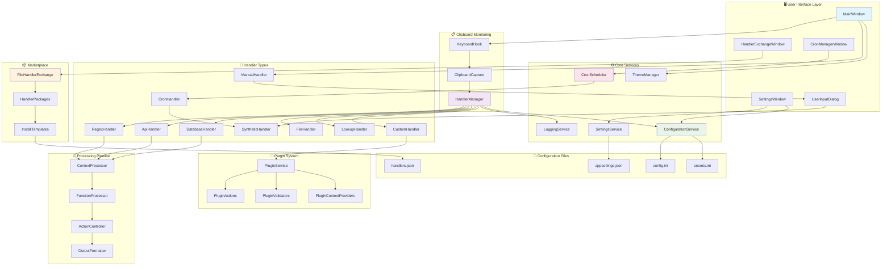
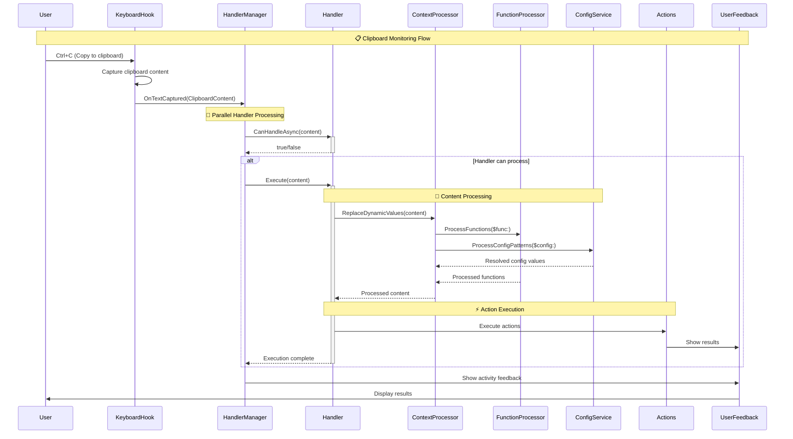
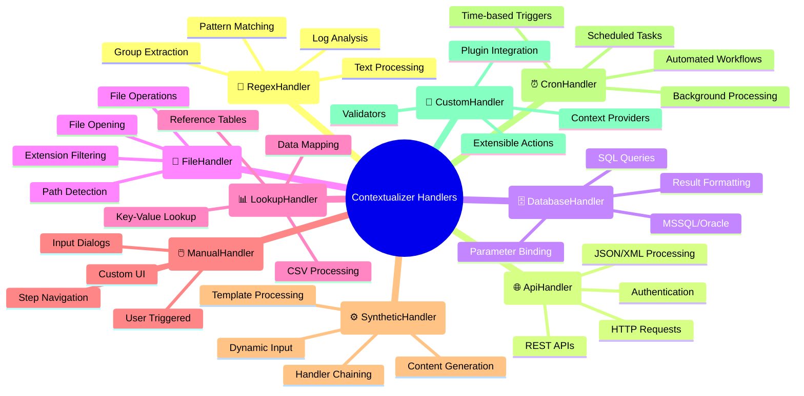
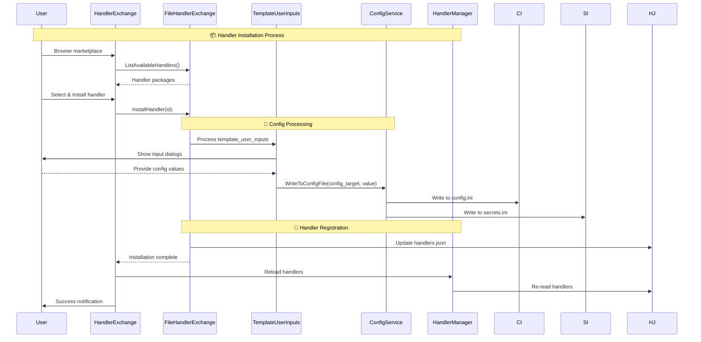

# Contextualizer System Flow - Complete Architecture

## 🎯 System Architecture Flow



## 🚀 Handler Execution Flow



## 🎛️ Handler Types & Capabilities



## 🔧 Configuration System

```mermaid
graph LR
    subgraph "📁 Config Files"
        CI[config.ini<br/>🔓 Public Settings]
        SI[secrets.ini<br/>🔒 Sensitive Data]
        AS[appsettings.json<br/>⚙️ App Settings]
    end

    subgraph "🎛️ Config Service"
        CS[ConfigurationService]
        SR[SetValue/GetValue]
        FF[File Watching]
    end

    subgraph "🔄 Pattern Replacement"
        PC[Pattern: $config:section.key]
        FC[Pattern: $func:method()]
        RC[Regex Context: $()]
    end

    subgraph "🖥️ Settings UI"
        SW[SettingsWindow]
        CP[Config Paths]
        AF[Auto File Creation]
    end

    subgraph "📦 Marketplace Integration"
        TUI[template_user_inputs]
        CT[config_target]
        AI[Auto Install Config]
    end

    %% Connections
    SW --> CS
    CS --> CI
    CS --> SI
    CS --> AS
    
    PC --> CS
    FC --> FP[FunctionProcessor]
    RC --> CP[ContextProcessor]
    
    TUI --> CT
    CT --> CS
    
    style CI fill:#e8f5e8
    style SI fill:#ffebee
    style CS fill:#e1f5fe
    style SW fill:#f3e5f5
```

## 📦 Marketplace & Installation Flow



---

Bu sistem mimarisi, Contextualizer'ın tam ekosistemini gösteriyor:

### ✨ Ana Özellikler:
1. **🔄 Real-time clipboard monitoring**
2. **⚡ Parallel handler processing** 
3. **🔧 Comprehensive config system**
4. **📦 Marketplace integration**
5. **⏰ Cron scheduling**
6. **🔌 Plugin extensibility**
7. **🎨 Theme-aware UI**

### 🎯 İş Akışı:
1. Kullanıcı **Ctrl+C** yapar
2. **KeyboardHook** yakalar
3. **HandlerManager** tüm handler'ları **paralel** çalıştırır
4. Her handler **CanHandle** kontrolü yapar
5. Uygun handler'lar **Execute** eder
6. **ContextProcessor** dinamik değerleri resolve eder
7. **Actions** execute edilir
8. **UserFeedback** sonuçları gösterir
