# Contextualizer User Guide - Complete Usage Manual

## 🚀 Getting Started

### 📥 Initial Setup
1. **Download & Extract** Contextualizer to `C:\PortableApps\Contextualizer\`
2. **Run** `WpfInteractionApp.exe`
3. **Configure** keyboard shortcut (default: Ctrl+C)
4. **Browse** marketplace for handlers

---

## 🎛️ Settings Configuration

### ⌨️ Keyboard Shortcut Setup


**Steps:**
1. Click **Settings** ⚙️ icon
2. Go to **Keyboard Shortcut** section
3. Check desired modifiers: `Ctrl` ✅ `Alt` ✅ `Shift` ✅ `Win` ✅
4. Select key from dropdown
5. Click **Save**

### 🔧 Config System Setup

```mermaid
graph TD
    A[Settings → Config System] --> B{Enable Config Files?}
    B -->|Yes| C[Set Config File Path<br/>config.ini]
    B -->|No| D[Use Static Values]
    C --> E[Set Secrets File Path<br/>secrets.ini]
    E --> F[Enable Auto-Create Files]
    F --> G[Save Configuration]
    
    style C fill:#e8f5e8
    style E fill:#ffebee
    style G fill:#e1f5fe
```


**File Locations:**
- **config.ini**: `C:\PortableApps\Contextualizer\Config\config.ini`
- **secrets.ini**: `C:\PortableApps\Contextualizer\Config\secrets.ini`
- **handlers.json**: `C:\PortableApps\Contextualizer\Config\handlers.json`

---

## 📦 Marketplace Usage

### 🛒 Installing Handlers


**Example - Installing JIRA Handler:**

1. **Open Marketplace** 📦
   - Click marketplace icon in main window
   - Browse available handlers

2. **Select JIRA Handler**
   - Click "Install" button
   - Installation dialog opens

3. **Provide Configuration:**
   ```
   📋 Installation Configuration
   
   🔑 JIRA API Key: [your-api-key-here]
   🌐 JIRA Base URL: https://company.atlassian.net
   📧 Enable Notifications: ✅ Yes
   ```

4. **Automatic Setup:**
   - Creates `secrets.ini`:
     ```ini
     [api_keys]
     jira_api_key=your-api-key-here
     ```
   - Creates `config.ini`:
     ```ini
     [endpoints]
     jira_base_url=https://company.atlassian.net
     
     [settings]
     enable_notifications=true
     ```

### 🔍 Managing Installed Handlers


---

## 🔧 Handler Types & Usage

### 📝 RegexHandler - Pattern Matching

**Use Case**: Extract email addresses from text

**Configuration Example:**
```json
{
  "name": "Email Extractor",
  "type": "regex",
  "regex": "\\b[A-Za-z0-9._%+-]+@[A-Za-z0-9.-]+\\.[A-Z|a-z]{2,}\\b",
  "output_format": "Found email: $(_match)"
}
```

**How to Use:**
1. Copy text containing emails: `"Contact: john@example.com for support"`
2. Press **Ctrl+C** (your configured shortcut)
3. Handler automatically extracts: `"Found email: john@example.com"`

### 🌐 ApiHandler - HTTP Requests

**Use Case**: Get GitHub user information

**Configuration Example:**
```json
{
  "name": "GitHub User Info",
  "type": "api",
  "url": "https://api.github.com/users/$config:api.github_username",
  "method": "GET",
  "headers": {
    "Authorization": "Bearer $config:api_keys.github_token"
  }
}
```

**How to Use:**
1. Copy GitHub username: `"octocat"`
2. Press **Ctrl+C**
3. Handler fetches user info from GitHub API
4. Displays formatted user data

### 🗄️ DatabaseHandler - SQL Queries

**Use Case**: Customer lookup by ID

**Configuration Example:**
```json
{
  "name": "Customer Lookup",
  "type": "database",
  "connectionString": "$config:database.connection_string",
  "query": "SELECT * FROM Customers WHERE CustomerID = @input",
  "connector": "mssql"
}
```

**How to Use:**
1. Copy customer ID: `"CUST001"`
2. Press **Ctrl+C**
3. Handler executes SQL query
4. Returns customer details in formatted table

### 📁 FileHandler - File Operations

**Use Case**: Open HTML files in browser

**Configuration Example:**
```json
{
  "name": "Open HTML Files",
  "type": "file",
  "file_extensions": [".html", ".htm"],
  "actions": [
    {
      "name": "open_file",
      "path": "$(_file_path)"
    }
  ]
}
```

**How to Use:**
1. Copy file path: `"C:\Projects\index.html"`
2. Press **Ctrl+C**
3. Handler detects HTML file
4. Opens file in default browser

### 🖱️ ManualHandler - User Triggered

**Use Case**: PL/SQL Editor

**Configuration Example:**
```json
{
  "name": "PL/SQL Editor",
  "type": "manual",
  "screen_id": "plsql_editor",
  "user_inputs": [
    {
      "key": "sql_query",
      "title": "Enter SQL Query",
      "is_multi_line": true
    }
  ]
}
```

**How to Use:**
1. **Right-click** tray icon
2. Select **"PL/SQL Editor"**
3. Input dialog opens
4. Enter SQL query
5. Handler processes and formats

### ⏰ CronHandler - Scheduled Tasks

**Use Case**: Daily report generation

**Configuration Example:**
```json
{
  "name": "Daily Sales Report",
  "type": "cron",
  "cron_expression": "0 9 * * MON-FRI",
  "reference_handler": "Database Sales Query",
  "cron_timezone": "Europe/Istanbul"
}
```

**How to Use:**
1. **Configure** in Cron Manager
2. **Set schedule**: "9:00 AM, weekdays"
3. **Handler runs automatically**
4. **Generates reports** without user intervention

---

## ⚡ Advanced Features

### 🔄 Function Processor

**Dynamic Values in Handlers:**
```json
{
  "seeder": {
    "current_time": "$func:now.format(HH:mm:ss)",
    "today_date": "$func:today.format(yyyy-MM-dd)",
    "user_name": "$func:username",
    "random_id": "$func:guid"
  }
}
```

**Available Functions:**

```mermaid
mindmap
  root((Functions))
    (📅 DateTime)
      now
      today
      yesterday
      tomorrow
      format
    (🔢 Utility)
      guid
      random
      username
      computername
      env
    (🔐 Crypto)
      hash.md5
      hash.sha256
      base64encode
      base64decode
    (🌐 URL)
      url.encode
      url.decode
      url.domain
      url.path
    (📝 String)
      string.upper
      string.lower
      string.trim
      string.replace
```


### 🔧 Config Patterns

**Using Configuration Values:**
```json
{
  "url": "$config:endpoints.api_base_url/users",
  "headers": {
    "Authorization": "Bearer $config:api_keys.access_token",
    "User-Agent": "$config:settings.user_agent"
  },
  "timeout": "$config:settings.request_timeout"
}
```

**Config File Structure:**
```ini
# config.ini - Public settings
[endpoints]
api_base_url=https://api.example.com
webhook_url=https://webhook.example.com

[settings]
user_agent=Contextualizer/1.0
request_timeout=30000
retry_count=3

# secrets.ini - Sensitive data
[api_keys]
access_token=abc123xyz789
webhook_secret=secret456
database_password=mypassword

[credentials]
smtp_username=user@example.com
smtp_password=emailpassword
```

---

## 🎨 UI Customization

### 🌙 Theme Management


**Available Themes:**
- **🌙 Dark**: Black background, white text
- **☀️ Light**: White background, black text  
- **🌫️ Dim**: Gray background, muted colors

### 📊 Activity Log

**Real-time monitoring:**
- **📋 Clipboard captures**
- **⚡ Handler executions** 
- **❌ Error messages**
- **✅ Success notifications**
- **⏰ Cron job runs**

**Log Levels:**
- 🔴 **Error**: Critical issues
- 🟡 **Warning**: Potential problems
- 🔵 **Info**: General information
- 🟢 **Success**: Successful operations

---

## 🛠️ Troubleshooting

### ❌ Common Issues


### 🔧 Debug Steps

1. **Enable Detailed Logging**
   - Settings → Logging → Set level to "Debug"
   - Check Activity Log for detailed messages

2. **Test Handler Manually**
   - Right-click tray → Manual Handlers
   - Select your handler to test

3. **Verify Configuration**
   - Settings → Config System → Check file paths
   - Open config files to verify values

4. **Check Regex Patterns**
   - Use online regex tester
   - Test with sample clipboard content

5. **Validate Cron Expressions**
   - Use cron expression validator
   - Check timezone settings

### 🏥 Recovery Options

**Reset Configuration:**
```
1. Close Contextualizer
2. Delete: C:\PortableApps\Contextualizer\Config\appsettings.json
3. Restart application
4. Reconfigure settings
```

**Reinstall Handler:**
```
1. Marketplace → Installed
2. Select problematic handler
3. Click "Uninstall"
4. Browse marketplace → Reinstall
5. Reconfigure if needed
```

---

## 🎯 Best Practices

### ✅ Handler Design

1. **Specific Regex Patterns**
   - Too broad: `.*@.*` ❌
   - Specific: `\b[A-Za-z0-9._%+-]+@[A-Za-z0-9.-]+\.[A-Z|a-z]{2,}\b` ✅

2. **Secure Configuration**
   - Use `secrets.ini` for sensitive data ✅
   - Never hardcode API keys ❌

3. **Error Handling**
   - Always include validation ✅
   - Provide meaningful error messages ✅

### 🔄 Workflow Optimization

1. **Handler Organization**
   - Group related handlers by project
   - Use descriptive names
   - Add proper descriptions

2. **Configuration Management**
   - Backup config files regularly
   - Use version control for handlers.json
   - Document custom configurations

3. **Performance Optimization**
   - Disable unused handlers
   - Optimize regex patterns
   - Set appropriate timeouts

---

## 🎓 Advanced Scenarios

### 🏢 Enterprise Setup

**Multi-Environment Configuration:**
```
🏢 Production
├── config.ini (prod endpoints)
├── secrets.ini (prod keys)
└── handlers.json (production handlers)

🧪 Testing  
├── config.ini (test endpoints)
├── secrets.ini (test keys)
└── handlers.json (test handlers)

👨‍💻 Development
├── config.ini (dev endpoints)
├── secrets.ini (dev keys)
└── handlers.json (dev handlers)
```

### 🔗 Handler Chaining

**Complex Workflows:**
```json
{
  "name": "Order Processing Chain",
  "handlers": [
    {
      "name": "Extract Order ID",
      "type": "regex",
      "regex": "ORDER-\\d{6}"
    },
    {
      "name": "Fetch Order Details", 
      "type": "database",
      "query": "SELECT * FROM Orders WHERE OrderID = @input"
    },
    {
      "name": "Send to API",
      "type": "api",
      "url": "$config:endpoints.order_api",
      "method": "POST"
    }
  ]
}
```

Bu kapsamlı rehber, Contextualizer'ın tüm özelliklerini ve kullanım senaryolarını detaylı olarak açıklıyor! 🚀
